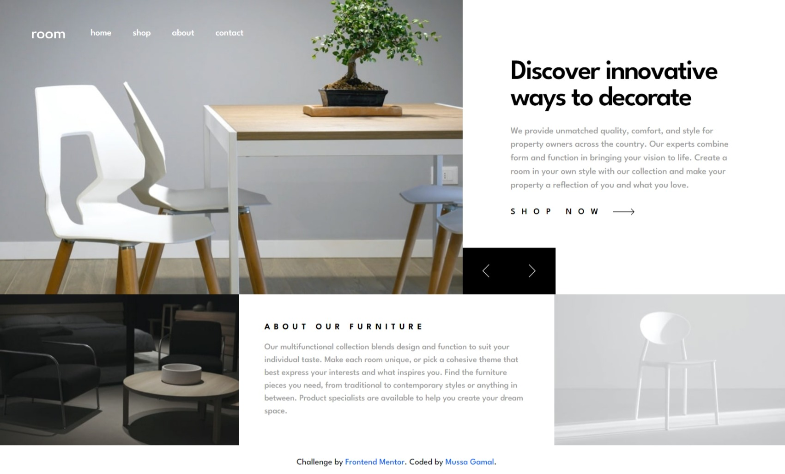

# Frontend Mentor - Room homepage solution

This is a solution to the [Room homepage challenge on Frontend Mentor](https://www.frontendmentor.io/challenges/room-homepage-BtdBY_ENq). Frontend Mentor challenges help you improve your coding skills by building realistic projects. 

## Table of contents

- [Overview](#overview)
  - [The challenge](#the-challenge)
  - [Screenshot](#screenshot)
  - [Links](#links)
- [My process](#my-process)
  - [Built with](#built-with)
  - [Continued development](#continued-development)
- [Author](#author)

## Overview

### The challenge

Users should be able to:

- View the optimal layout for the site depending on their device's screen size
- See hover states for all interactive elements on the page
- Navigate the slider using either their mouse/trackpad or keyboard

### Screenshot

### Links

- Solution URL: [Add solution URL here]([https://your-solution-url.com](https://www.frontendmentor.io/solutions/responsive-webpage-using-bootstrap-5-and-css-flexbox-sEB-qqnblW))
- Live Site URL: [Add live site URL here](https://mussa-gamal.github.io/room-homepage-master/)

## My process

### Built with

- Semantic HTML5 markup
- CSS custom properties
- Flexbox
- JavaScript
- [Bootstrap 5](https://getbootstrap.com/) - CSS library
- [AOS](https://michalsnik.github.io/aos/) - JS library

### Continued development

I would like to explore more JS libraries out there like React to use on future projects that can help achieve greater and expected results on the web with less effort, just like Bootstrap in CSS which saves so much time and effort in making a responsive webpage.

## Author

- LinkedIn - [Mussa Gamal](https://www.linkedin.com/in/mussa-gamal/)
- Frontend Mentor - [@Mussa-Gamal](https://www.frontendmentor.io/profile/Mussa-Gamal)
